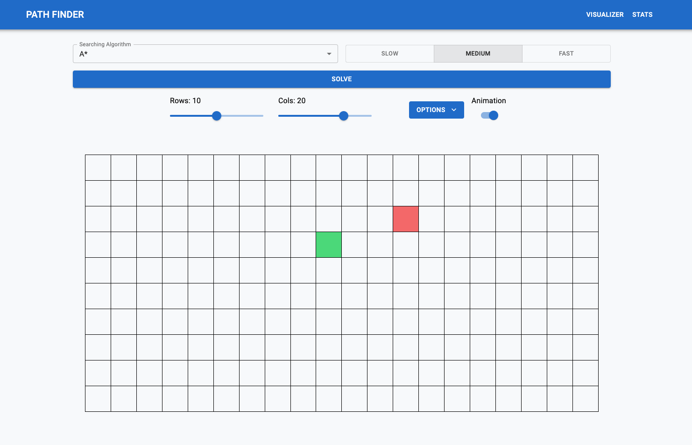
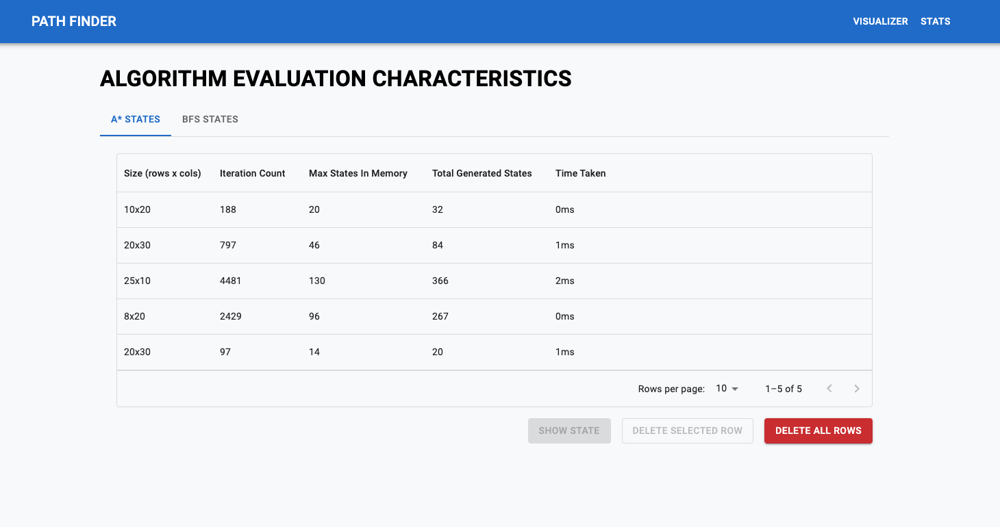

# Path Finder

### [Live Demo](https://652ef6fa14553502e92470a2--idyllic-haupia-98e180.netlify.app/)

## Description

A Program that visualizes the path finding process and uses the following search algorithms:

- Noninformative: BFS
- Informative: A\*

## Main features

- Maze generation and building
- Awesome animations that demonstrate how algorithm works
- Stats about each searching trial

## Preview

## Run locally

- clone this repo
- `npm install`
- `npm run dev`
- open `localhost:3000`

## Technologies used

- React
- Redux
- React-Router
- Material UI
